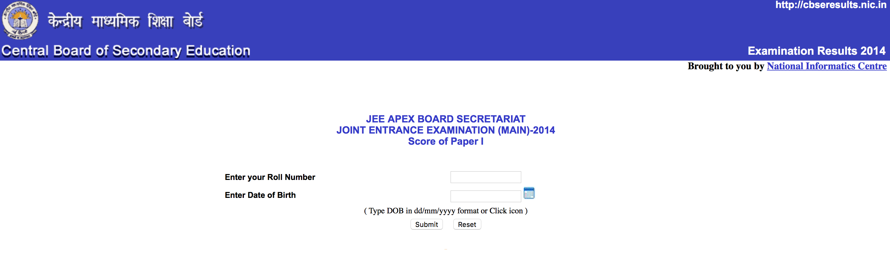

# webscraping-JEE

I wrote this code in order to figure out my JEE roll number that I forgot. 

<p>
  
</p>

This is a simple node script that requests("spams") the website with all possible roll numbers and your date of birth

It returns the roll number if if it finds a valid response 

## How do I run this

```
npm install
node --max_old_space_size=<size_in_megabytes> app.js
```

Note: Change the loop variables to loop over the desired roll number limits 